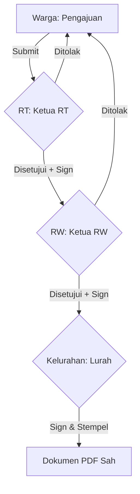

# 🏛️ WARTA (Warga Kita)
**Solusi Digitalisasi Birokrasi Kelurahan & Harmonisasi Sosial Kemasyarakatan**

[](https://flutter.dev/)
[](https://firebase.google.com/)
[](https://dart.dev/)

WARTA (Warga Kita) adalah platform ekosistem digital yang dirancang khusus untuk mentransformasi sistem administrasi konvensional di tingkat RT, RW, hingga Kelurahan menjadi sebuah sistem yang modern, transparan, dan responsif. Berfokus pada kemudahan akses (Accessibility) dan keindahan antarmuka (Premium Aesthetics), WARTA hadir sebagai jembatan antara warga dan pemerintah setempat.

---

## 📖 Latar Belakang & Filosofi Proyek
Seringkali, komunikasi antara warga dan pengurus wilayah terhambat oleh keterbatasan waktu dan media. Masalah seperti pengajuan surat yang memakan waktu lama, transparansi kas yang minim, hingga koordinasi keamanan yang masih manual menjadi motivasi utama pembuatan WARTA. Aplikasi ini dibangun dengan prinsip:
- **Efficiency:** Memangkas birokrasi fisik menjadi digital.
- **Transparency:** Semua aliran dana (iuran) dapat dipantau oleh warga.
- **Security:** Fitur keamanan lingkungan yang terintegrasi secara real-time.

---

## 🚀 Modul & Fitur Unggulan Secara Detail

### 1. 🔐 Registrasi Berbasis AI (KTP OCR)
Lupakan pengisian formulir yang membosankan. WARTA menggunakan teknologi cerdas untuk mengenali identitas warga secara otomatis.
- **Teknologi:** Google ML Kit Optical Character Recognition (OCR).
- **Mekanisme:** Sistem memindai gambar KTP, mendeteksi blok teks, dan memetakan data NIK, Nama, serta Alamat langsung ke dalam profil pengguna. 
- **Manfaat:** Meminimalisir kesalahan input data (Human Error) dan mempercepat proses onboarding warga baru hingga 80%.

### 2. 🚨 Sistem Keamanan Lingkungan & Darurat (SOS)
Keamanan adalah prioritas utama. WARTA menyediakan jalur komunikasi instan untuk kondisi genting.
- **Tombol Darurat (Panic Button):** Sekali tekan, notifikasi dengan prioritas tinggi akan dikirimkan ke seluruh pengurus (RT/RW) disertai lokasi pengirim.
- **Manajemen Ronda Malam:** Penjadwalan petugas ronda secara digital. Pengurus dapat memantau kehadiran petugas dan warga dapat mengetahui siapa yang sedang bertugas menjaga lingkungan mereka malam ini.

### 3. 📄 Administrasi Surat Menyurat (Digital Workflow)
Mengimplementasikan alur birokrasi 3-tingkat yang sesuai dengan standar administrasi di Indonesia.
- **Alur Kerja:** Warga mengajukan -> Verifikasi RT -> Verifikasi RW -> Pengesahan Lurah.
- **Tanda Tangan Digital:** Setiap pengurus dapat membubuhkan tanda tangan digital secara langsung di dalam aplikasi, yang kemudian akan di-*inject* ke dalam dokumen PDF resmi.
- **PDF Engine:** Menggunakan library `pdf` dan `printing` untuk menghasilkan dokumen yang siap cetak dengan tata letak yang presisi.

### 4. 💰 Transparansi Finansial (Kas & Iuran)
Membangun kepercayaan warga melalui keterbukaan informasi keuangan.
- **Pembayaran Mandiri:** Warga cukup mengunggah bukti transfer iuran bulanan.
- **Validasi Bendahara:** RT/Bendahara memiliki dashboard khusus untuk melakukan pengecekan bukti bayar (Accept/Reject).
- **Laporan Real-time:** Menampilkan grafik atau daftar kas yang masuk dan keluar, memastikan setiap rupiah warga dapat dipertanggungjawabkan.

### 5. 📢 Laporan Warga (E-Reporting)
Media aspirasi warga untuk perbaikan lingkungan.
- **Kategori Laporan:** Sampah, Infrastruktur rusak, Pengaduan sosial, dll.
- **Tracking Status:** Warga bisa memantau apakah laporannya sudah "Diterima", "Sedang Ditindaklanjuti", atau "Selesai".

### 📰 Fitur Tambahan:
- **Warta Berita:** Feed berita regional untuk info kegiatan warga (e.g. kerja bakti, vaksinasi).
- **Profil Digital & QR:** Kartu identitas digital warga yang bisa discan oleh admin untuk verifikasi cepat di lapangan.

---

## 🏗️ Arsitektur Alur Kerja (3-Tier Approval)
Sistem ini memastikan validitas dokumen melalui hierarki yang ketat:



---

## 🎨 UI/UX Design Philosophy
Kami tidak hanya fokus pada fungsi, tapi juga pada pengalaman pengguna yang menyenangkan.
- **Premium Aesthetics:** Menggunakan skema warna yang elegan (Harmony Colors) dan mode gelap yang nyaman.
- **Glassmorphism:** Implementasi `BackdropFilter` pada dialog dan modal untuk menciptakan efek kaca transparan yang modern.
- **Consistency:** Ikonografi menggunakan gaya *Fill* yang konsisten di seluruh aplikasi untuk navigasi yang lebih intuitif.

---

## 📁 Struktur Direktori Proyek
```text
WARTA_APP/
├── apk/            # Hasil kompilasi aplikasi (.apk)
├── docs/           # Dokumentasi (PDF, SRS, Diagram Alur)
├── frontend/       # Kode Sumber Utama (Flutter)
│   ├── lib/
│   │   ├── models/     # Definisi Data (User, Iuran, Surat, Aktivitas)
│   │   ├── services/   # Integrasi Firebase, Cloudinary, & OCR
│   │   ├── views/      # Tampilan (Auth, Home, Admin Dashboards)
│   │   ├── viewmodels/ # Logika Bisnis (Provider State Management)
│   │   └── widgets/    # Komponen UI Reusable
│   ├── assets/         # Resource gambar, font, dan animasi
│   └── test/           # Unit & Widget testing
└── README.md       # Dokumentasi Utama (Root)
```

---

## 🔑 Akses Uji Coba (Demo Accounts)
Silakan gunakan akun berikut untuk mencoba seluruh level otorisasi:

| Peran | Username/Email | Password |
| :--- | :--- | :--- |
| **Warga** | `wahyuredjo` | `wahyu123` |
| **Ketua RT** | `rachmat kurniawan` | `rt1234` |
| **Ketua RW** | `rw03` | `rw1234` |
| **Lurah** | `lurah` | `lurah1234` |

---

## ⚙️ Panduan Pengembang
1. **Clone Repo:** `git clone https://github.com/username/warta_app.git`
2. **Pathing:** Masuk ke folder `cd frontend`
3. **Instalasi:** `flutter pub get`
4. **Build APK:** `flutter build apk --release --no-tree-shake-icons`

---

## 👨‍💻 Author
**Yasman Yazid**  
*NIM: [Masukkan NIM Anda]*  
*Mahasiswa Informatika - Semester 4*  

---
*© 2026 WARTA (Warga Kita). Proyek ini dikembangkan untuk memenuhi tugas akhir mata kuliah Pemrograman Mobile.*
